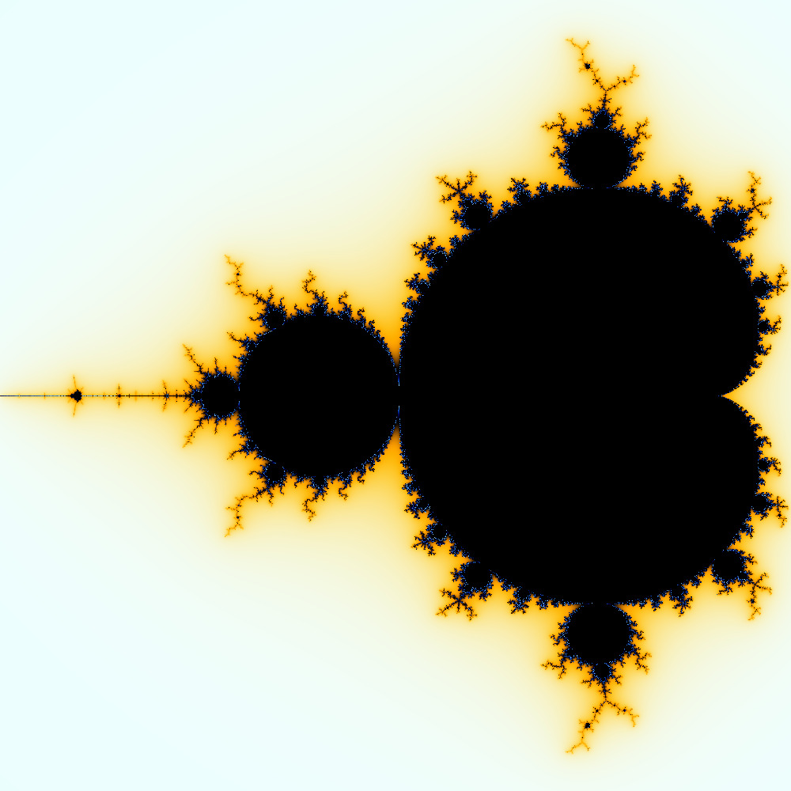

<a name="readme-top"></a>

<p align="center">
  <a href="https://github.com/adkoprek/Mandelbrot/graphs/contributors">
	  
  </a>
  <a href="https://github.com/adkoprek/Mandelbrot/network/members">
	  
  </a>
  <a href="https://github.com/adkoprek/Mandelbrot/stargazers">
	  
  </a>
  <a href="https://github.com/adkoprek/Mandelbrot/issues">
	  
  </a>
  <a href="https://github.com/adkoprek/Mandelbrot/blob/master/LICENSE.txt">
	  
  </a>
</p>

<br />
<div align="center">
  <a href="https://github.com/adkoprek/Mandelbrot">
    
  </a>

  <h3 align="center">Mandelbrot Set - A never ending fractal</h3>

  <p align="center">
    A worldwide known fractal for its beuty
    <br />
    <a href="https://en.wikipedia.org/wiki/Bcrypt">Wiki Article</a>
    ·
    <a href="https://github.com/adkoprek/WTE/issues/new?labels=bug&template=bug-report---.md">Report Bug</a>
    ·
    <a href="https://github.com/adkoprek/WTE/issues/new?labels=enhancement&template=feature-request---.md">Request Feature</a>
  </p>
</div>

### Built With
[![CPP][CPP.js]][CPP-url]
[![GTK][GTK.js]][GTK-url]
[![TBB][TBB.js]][TBB-url]


### Prerequisites

  - C++ 17 compiler
  - CMake 3.16 Version
  - GTK4
  - GLIB2
  - TBB

## Getting Started

If you want your own copy just follow this steps

Clone the repo
```bash
git clone https://github.com/adkoprek/Mandelbrot
```

Create a cmake directory
```bash
mkdir cmake
cd cmake
```

Build the project and install
```bash
cmake .. -DCMAKE_BUILD_TYPE=Release
make
```

## Usage

You can just run the simple GTK visulisation
```bash
../bin/<Your Architecture>/Release/mandelbrot -x <width in pixel> -y <height in pixel> 
```

Or you can generate a video with a `.cfg` configuration file, the template is `mandelbrot_video.cfg`
```bash
../bin/<Your Architecture>/Release/mandelbrot_video <.cfg file> 
```

## Contributing

Contributions are what make the open source community such an amazing place to learn, inspire, and create. Any contributions you make are **greatly appreciated**.

If you have a suggestion that would make this better, please fork the repo and create a pull request. You can also simply open an issue with the tag "enhancement".
Don't forget to give the project a star! Thanks again!

1. Fork the Project
2. Create your Feature Branch (`git checkout -b feature/AmazingFeature`)
3. Commit your Changes (`git commit -m 'Add some AmazingFeature'`)
4. Push to the Branch (`git push origin feature/AmazingFeature`)
5. Open a Pull Request

## License

Distributed under the MIT License. See `LICENSE.txt` for more information.

[CPP.js]: https://img.shields.io/badge/C%2B%2B-00599C?style=for-the-badge&logo=c%2B%2B&logoColor=white
[CPP-url]: https://isocpp.org/
[GTK.js]: https://img.shields.io/static/v1?style=for-the-badge&message=GTK&color=222222&logo=GTK&logoColor=7FE719&label=
[GTK-url]: https://gtk.org
[TBB.js]: https://img.shields.io/badge/TBB-0071C5?style=for-the-badge&logo=intel&logoColor=white
[TBB-url]: https://www.intel.com/content/www/us/en/developer/tools/oneapi/onetbb.html
